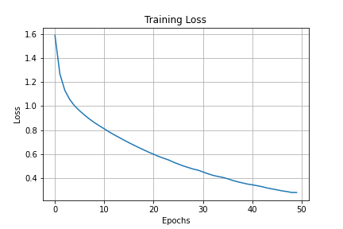
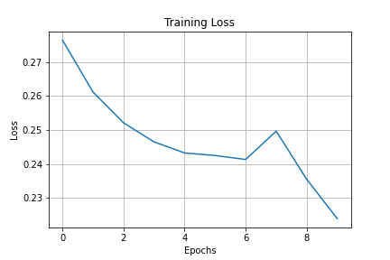

# Image Captioning with Neural Attention

Automatic Image Caption Generator with Bahdanau Attention.
InceptionNetV3 is used for Feature Extraction of Images.
CNN-RNN Encoder Decoder Model is inspired from TensorFlow-Tutorials.

## Model Specifications and Training Specifications
* Embedding_Dims = 256
* VocabSize = 5000
* Units = 512
* FeaturesShape = 2048
* AttentionFeatures = 64
* Epochs = 60

### Loss
For the fist 50 Epochs.

For the next 10 Epochs.

